<div align="center">



# PAARTH

**Proactive Agentic AI for Routing, Telemetry & Heuristics**

*The routing brain between your AI and your code.*

Pārtha is Arjuna's name in the Mahabharata — the archer who never misses; PAARTH routes every task to the right skill.

[](https://github.com/animeshbasak/Paarth)
[](https://github.com/animeshbasak/Paarth/releases/tag/v4.0.0)
[](https://github.com/animeshbasak/Paarth/actions/workflows/ci.yml)
[](LICENSE)
[](#receipts)
[](#receipts)
[](docs/agent-memory.md)

```bash
git clone https://github.com/animeshbasak/Paarth
bash PAARTH/install.sh
```

</div>

---

## Capability map

Every major surface, verified against the tree, one click away.

| Surface | Count | Section |
|---|---|---|
| Skills | 52 | [Skills](#skills) |
| Income pack | 20 skills | [Income pack](#income-pack) |
| CLI tools | 27 | [CLI tools](#cli-tools) |
| Specialist agents | 6 | [Specialist agents](#specialist-agents) |
| Lifecycle hooks | 9 | [Hooks](#hooks) |
| Routing rules | 63 | [The routing brain](#the-routing-brain) |
| Learning loop | — | [The learning loop](#the-learning-loop) |
| Memory-OS | 9 MCP tools | [Memory-OS](#memory-os) |
| Injection budget | — | [Injection budget](#injection-budget) |
| Session auto-capture | — | [Session auto-capture](#session-auto-capture) |
| Platform adapters | 9 IDEs | [Platform support](#platform-support) |
| Slash commands | 9 | [Platform support](#platform-support) |
| Cost guard | — | [Cost guard](#cost-guard) |
| Org policy | — | [Org policy](#org-policy) |
| CI matrix | 2 OS | [CI matrix](#ci-matrix) |
| Why PAARTH | — | [Why PAARTH](#why-paarth) |

## Table of contents

[Quickstart](#quickstart) · [The problem this fixes](#the-problem-this-fixes) · [Skills](#skills) · [CLI tools](#cli-tools) · [Specialist agents](#specialist-agents) · [Hooks](#hooks) · [Memory-OS](#memory-os) · [The routing brain](#the-routing-brain) · [How it saves tokens](#how-it-saves-tokens) · [Cost guard](#cost-guard) · [Org policy](#org-policy) · [Platform support](#platform-support) · [Why PAARTH](#why-paarth) · [Optional bundles](#optional-bundles) · [Receipts](#receipts) · [Roadmap](#roadmap) · [Where things live](#where-things-live) · [Version history](#version-history) · [FAQ](#faq) · [Credits](#credits)

---

## Quickstart

```bash
git clone https://github.com/animeshbasak/Paarth
cd PAARTH && bash install.sh                        # ~30s, ~120 MB, idempotent
```

```bash
/paarth fix the dark mode bug                       # in Claude Code: routes to a skill chain
paarth-classify "design the API for comments"       # same router, from any shell
paarth-cost today                                   # your real Anthropic spend
paarth-report --json                                # one-page pilot report
```

Multi-tool setups: `install-universal.sh` auto-detects Claude Code, Cursor, Copilot, Continue, Gemini, Windsurf, Codex, Aider, and Antigravity (`--list` to preview, `--platform <name>` to target one).

---

## The problem this fixes

You bought your AI coding tool. You like it. Then you started paying four hidden taxes:

1. **You wrote the same rules four times.** `CLAUDE.md`, `.cursorrules`, `.continue/rules/*.md`, `.github/copilot-instructions.md` — four files, drifting apart.
2. **Your AI re-reads the codebase every conversation.** Ask about last month's work in different words and keyword search finds *nothing* — 0% rediscovery on paraphrased queries without semantic recall (100% with it).
3. **At 4 PM, you hit the rate limit.** Your free local model sits idle while you stare at "please wait 5 hours."
4. **Your AI runs `git push --force` because you said "fix it and push."** Or `rm -rf` on a directory it misread.

PAARTH removes all four: one config, one safety gate, one cost tracker, one free local fallback, one persistent memory. Every capability below is a real, replaceable file under `bin/`, `skills/`, or `hooks/` — nothing is magic.

---

## Skills

Skills are the source of truth. The classifier composes them into chains; `paarth-compile` ships them to every platform. **52 skills**, grouped:

**Routing & meta** — `paarth` (master entrypoint) · `paarth-learn-loop` (pattern promotion/decay) · `paarth-safety` (reversibility gate) · `paarth-switch` (model control) · `dynamic-skills` (hot-reload) · `fanout` (parallel skills)

**Planning & review** — `autoplan` (product→design→eng) · `plan-ceo-review` · `plan-design-review` · `plan-eng-review` · `review` (6-point gate) · `sparc` (5-phase methodology) · `office-hours` (6 YC questions) · `investigate` (root-cause)

**Security & observability** — `cso` (OWASP/STRIDE/secrets) · `aidefence` (prompt-injection + PII) · `observability` (spans, metrics, anomalies)

**Cost & model management** — `cost-budget` · `auto-fallback` · `free-llm` · `token-stats`

**Dev tooling** — `ship` · `testgen` · `diff-risk` · `agent-pool` · `bench` · `learn` · `autopilot` · `scraping`

**Creative / front-end** — `framer-motion` · `webgl-craft` · `video-craft`

> Plus the bundled `agent-skills:*` namespace — 16 step-by-step engineering skills credited to Addy Osmani's [agent-skills](https://github.com/addyosmani/agent-skills).

### Income pack

**20 `income:*` skills**, curated from the community ecosystem (license-gated, injection-screened, pinned SHAs — see [ATTRIBUTION](docs/ATTRIBUTION.md)):

- **Marketing** (10): `cold-email` · `copywriting` · `seo-audit` · `programmatic-seo` · `cro` · `pricing` · `social-content` · `product-launch` · `email-marketing` · `paid-ads`
- **Sales**: `sales-outreach` · **Startup**: `validate-idea` · `growth` · `investor-pitch` · `gtm-strategy` · **Creator**: `youtube-strategy` · `linkedin-content`
- **Dev income** (first-party): `freelance-proposals` · `productized-service` · `mvp-scope`

---

## CLI tools

**27 command-line tools**, each a real executable installed to `~/.local/bin/`.

### Routing, learning & orchestration
| Tool | What it does |
|---|---|
| `paarth-classify` | Routes a task string → JSON skill chain + complexity + hint. The brain. |
| `paarth-optimize` | Brain step 0 — rewrites a raw prompt into a tight directive before classify/dispatch. |
| `paarth-chain <name>` | Prints the ordered steps of a named YAML chain. |
| `paarth-compile` | Rewrites `skills/` into every platform's native format. |
| `paarth-patterns` | Learning-loop store: `list` · `promote` · `decay` · `protect` · `prune`. |
| `paarth-capture` | Distills each session transcript into memory-os entries from the Stop hook. |
| `paarth-oneshot` | Computes your one-shot rate — % of tasks finished on the first attempt. |
| `paarth-reload` | Mirrors repo skills into `~/.claude/skills/` for hot pickup. |
| `paarth-pool` | Orchestrate parallel Claude Code sessions: `spawn` · `list` · `tag` · `kill` · `status`. |

### Quality, safety & shipping
| Tool | What it does |
|---|---|
| `paarth-diff-risk` | Per-diff impact: low/medium/high/critical + 5 risk flags + CODEOWNERS suggestion. |
| `paarth-ship <base>` | Full pipeline: rebase → test → audit → review → version bump → CHANGELOG → push → PR. |
| `paarth-sparc` | 5-phase gated methodology: `init` · `gate` · `advance` · `report` · `status`. |
| `paarth-testgen` | Coverage gap detection: `scan` · `gap --top N` · `suggest <file>`. |
| `paarth-aidefence` | Prompt injection + PII scanner over 58 patterns. |

### Autonomy & data
| Tool | What it does |
|---|---|
| `paarth-autopilot` | Unattended loop: `enable` · `status` · `tasks` · `predict` · `iter`. |
| `paarth-learn` | Per-project learnings diary: `add` · `list` · `search`. |
| `paarth-scrape` | Scrapling wrapper for protected pages: `install` · `fetch` · `browser` · `status`. |

### Observability
| Tool | What it does |
|---|---|
| `paarth-trace <traceId>` | Builds the parent-child span tree, flags the p95 bottleneck. |
| `paarth-metrics [today\|week\|all]` | Aggregates counter/gauge/histogram metrics with p50/p95/p99 + anomaly flags. |
| `paarth-obs` | Low-level emitter for spans + metrics (used by the hooks). |
| `paarth-obs-rotate` | Daily-rotates observability logs, prunes anything older than 30 days. |
| `paarth-report` | One-page pilot report from local telemetry. Markdown or `--json`. |

Cost & model tools (`paarth-cost`, `paarth-cost-alerts`, `paarth-switch`, `paarth-verbosity`) live under [Cost guard](#cost-guard); `paarth-org-policy` lives under [Org policy](#org-policy); `paarth-memory-mcp` (the Memory-OS server) lives under [Memory-OS](#memory-os).

---

## Specialist agents

The classifier dispatches these named personas automatically when a task is complex enough. **6 agents**, each with its own scoped safety hook.

| Agent | Role | Triggers on |
|---|---|---|
| `architect` | Designs APIs, module boundaries, DDD | "design API", "system architecture" |
| `coder` | Implements features, refactors, debugs | "implement", "refactor", "fix the X" |
| `reviewer` | Pre-merge diff gate | "review code", "audit PR" |
| `security-architect` | Threat models, STRIDE | "threat model", "security review" |
| `tester` | Writes unit/integration/e2e tests, TDD | "write tests", "coverage", "TDD" |
| `paarth-brain` | The routing brain — proactively picks the chain | any build / fix / explore / design / review / ship task |

---

## Hooks

**9 lifecycle hooks.** On Claude Code these are real harness hooks firing across the full session lifecycle; on every other platform the same logic self-polices via the matching skill.

| Lifecycle event | Hook | What it does |
|---|---|---|
| `SessionStart` | `paarth-session-start.py` | Inits session state, primes memory, emits the route header. |
| `UserPromptSubmit` | `paarth-prompt-submit.py` | Classifies the prompt, runs AIDefence, attaches the chain. |
| `PreToolUse` | `paarth-safety.py` | The reversibility gate — blocks `rm -rf`, `push --force`, `DROP`, `.env` edits. |
| `PostToolUse` | `paarth-tracker.sh` | Emits a span + token metric on every tool call. |
| `PermissionRequest` | `paarth-permission.py` | Advisory overlay on permission prompts. |
| `PreCompact` | `paarth-precompact.py` | Marks the compaction boundary, checkpoints state. |
| `Stop` | `paarth-distill.sh` | Distills patterns, updates routes, rotates observability logs. |
| `SubagentStop` | `paarth-subagent-stop.py` | Tracks subagent outcomes, applies the safety gate to dispatches. |
| `Notification` | `paarth-notification.py` | Formats rich notifications (cost alerts, pattern promotions, traces). |

Helper scripts (`paarth-statusline.sh`, `paarth-limit-watch.sh`, `paarth-state-init.sh`) drive the status line, cost watchdog, and first-run scaffolding.

---

## Memory-OS

`paarth-memory-mcp` is the MCP server so your AI remembers decisions across sessions instead of re-discovering them every conversation.

```bash
memory_write("We switched billing rounding to banker's rounding — finance signed off", kind="decision")
memory_recall("how do we round billing amounts?")
# → "banker's rounding — finance signed off (decision, 6 days ago)"
```

**9 MCP tools** — *Memory:* `memory_recall` · `memory_write` · `memory_list` · `memory_pin` · `memory_forget` · `memory_retrieve` (pulls back the original of any compressed/cached content — see [CCR](#how-it-saves-tokens)). *Knowledge graph:* `graph_ingest` · `graph_query` · `graph_neighbors`.

- **Namespaced per git-root** — projects never leak into each other; a `__global__` namespace holds cross-project facts.
- **Sanitized on write** — prompt-injection and PII patterns are stripped before anything is persisted.
- **Decay + consolidation** — entries older than 90 days *and* idle 30+ days archive; near-duplicates (cosine ≥0.92) dedupe; a cron installs weekly decay.
- **Ground Truth Hierarchy** — recalled memory is injected *above* training data.
- **Hybrid vector recall** — opt-in via `PAARTH_MEMORY_VECTOR=on`, blends FTS keyword ranking with embedding cosine (reciprocal rank fusion). Local-first (Ollama → OpenRouter).
- **One memory, every tool** — registers into Claude Code, Cursor, and Gemini CLI today; Copilot + Antigravity experimental. [Track the rollout →](docs/plans/2026-06-03-memory-os-integration.md)

Storage: `~/.paarth/memory-os/memory.db` (SQLite + FTS5), overridable via `PAARTH_MEMORY_HOME`. **196 pytest tests** cover schema, decay, semantic dedup, migration, hybrid recall, telemetry, security regressions, and the compression/graph additions. `paarth-memory bench` replays a fixture corpus: **0% FTS-only → 100% hybrid** paraphrase rediscovery. Setup: [docs/memory-os-quickstart.md](docs/memory-os-quickstart.md).

---

## The routing brain

You type a task in plain English. The classifier (`bin/paarth-classify`) reads the intent, scores complexity, and emits a **skill chain** as JSON.

```bash
$ paarth-classify "fix the dark mode bug"
→ debugging → TDD → verification

$ paarth-classify "scrape this Cloudflare-protected page"
→ scraping   (Scrapling under the hood)
```

### Prompt optimization
Before anything is classified, `bin/paarth-optimize` (brain step 0) rewrites the raw prompt into a tight directive — filler stripped, rambling multi-ask prompts split into numbered steps. Deterministic, no API call, runs inside `UserPromptSubmit`. Kill switch: `PAARTH_OPTIMIZE=0`.

### Routing rules
**63 routing rules** (`brain/rules.yaml`) map task signals to chains. `mempalace-wake` always runs first; `verification-before-completion` always runs last on build tasks.

### The learning loop
Every successful chain logs to `~/.paarth/brain/routes.jsonl`. When the same chain succeeds repeatedly, `paarth-patterns promote` lifts it into `patterns.jsonl`, and the classifier reads patterns *before* static rules — short-circuiting future runs, failure-aware by chain.

---

## How it saves tokens

Memory stops your AI re-discovering *decisions*; these four pieces stop it wasting tokens on *content* and *re-derivation* — all local-first, all reversible.

**CCR & SmartCrusher (compression in).** Bulky tool output is dropped from context but cached by content hash, leaving a tiny sentinel (`ccr:<hash>:<count>`); `memory_retrieve(token)` gets it back on demand — lossy in context, lossless on request, TTL-bounded. SmartCrusher scores each row of near-identical JSON by field-rarity and outlier z-score, keeps the signal, folds the rest into one CCR sentinel — still valid JSON, still reversible.

**Verbosity shaper (compression out).** `paarth-verbosity` reads your behavioral signals (interrupt/halt rate) and recommends a terseness level 0–5, trimming what the model *writes back*.

**Knowledge graph.** `graph_ingest` parses a `graphify` output into `entities` + `triples` (confidence-typed, temporal provenance), dedupes at cosine≥0.92, and `graph_query` returns matching entities **plus their relations**, RRF-blended with text recall — so "how does auth work?" returns the entity, what calls it, and the prior decision about it, not just a text snippet.

### Injection budget
A hard token budget caps every hook injection (`PAARTH_INJECT_BUDGET_TOKENS`); drops are logged as measurable savings instead of silently truncating.

### Session auto-capture
Every session is distilled into memory-os entries (summary, decisions, corrections) by the Stop hook — rule-based, API-free, upserted per session via `paarth-capture`. Memory grows without a human writing it down.

---

## Cost guard

| Tool | What it does |
|---|---|
| `paarth-cost [today\|week\|all]` | Real Anthropic spend, grouped by model, with a coach note. `--json`. |
| `paarth-cost-alerts` | Fires tiered budget alerts; drops `auto-downgrade.flag` near the limit. |
| `paarth-switch` | Swap the active LLM backend: `list` · `to <model>` · `back` · `canary` · `status` · `auto on\|off`. |
| `paarth-verbosity` | Output-token shaper (see [How it saves tokens](#how-it-saves-tokens)). |

At 90% of budget, `auto-fallback` proposes Opus → Sonnet → Haiku, or hands off to a local model via the `free-claude-code` proxy on port 18082.

---

## Org policy

`paarth-org-policy` (`show` · `set` · `check`) — one file, `~/.paarth/org-policy.json`, caps spend, limits which model tiers are allowed, and redacts project names from shared reports. `check` is the gate the safety hook and `paarth-report --org-policy` call: spend vs. the org budget cap, off-policy model calls, redacted per-project spend.

---

## Platform support

`bin/paarth-compile` rewrites the same skills into each platform's native format. Hooks fire on Claude Code; every other platform self-polices via the `paarth-safety` skill. **9 IDE adapters** live under `adapters/` (plus `_shared/memory-os-lib.sh`).

| | Claude Code | Cursor | Codex | Copilot | Continue | Windsurf | Gemini | Aider | Antigravity |
|---|---|---|---|---|---|---|---|---|---|
| **Skills routed** | 32 | `.mdc` | `AGENTS.md` | inline | rules | rules | skills | `CONVENTIONS.md` | rules |
| **Safety** | 9 hooks | self-polices | self-polices | self-polices | self-polices | self-polices | self-polices | self-polices | self-polices |
| **Learning loop** | ✅ | reads store | reads store | reads store | reads store | reads store | reads store | reads store | reads store |
| **Cost tracker** | ✅ | ✅ | ✅ | ✅ | ✅ | ✅ | ✅ | ✅ | ✅ |
| **Memory-OS** | ✅ | ✅ | — | exp. | — | — | ✅ | — | exp. |

The universal installer auto-detects which tools you have. **Slash commands** (Claude Code, 9): `/paarth` · `/sparc` · `/testgen` · `/diff-risk` (`/jujutsu` legacy alias) · `/aidefence` · `/autopilot` · `/observe` · `/paarth-switch`.

---

## Why PAARTH

**PAARTH is not another AI coding tool — it's the layer that makes the one you already use better.** It sits underneath Claude Code, Cursor, or Copilot, compiles one config into each, and adds what none of them ship: a safety gate, a cost tracker with a free local fallback, one memory across every tool, reversible compression, and a persistent knowledge graph.

| Capability | Your AI tool alone | aider | Headroom *(compression)* | Memory MCPs *(Mem0, etc.)* | **PAARTH** |
|---|:---:|:---:|:---:|:---:|:---:|
| One config → every tool natively | ✗ | ✗ | ✗ | ✗ | ✅ |
| Plain-English task → auto skill chain | partial | ✗ | ✗ | ✗ | ✅ 63 rules + learning |
| Reversibility safety gate | ✗ | ✗ | ✗ | ✗ | ✅ harness hook |
| Cost tracking + free local fallback | ✗ | ✗ | ✗ | ✗ | ✅ |
| Persistent memory shared across tools | ✗ | ✗ | partial | ✅ (single tool) | ✅ |
| Semantic / paraphrase recall | ✗ | ✗ | ✗ | ✅ | ✅ hybrid RRF |
| Reversible context compression (in) | ✗ | ✗ | ✅ best-in-class | ✗ | ✅ CCR + SmartCrusher |
| Output-token reduction (out) | ✗ | ✗ | ✅ | ✗ | ✅ verbosity shaper |
| Persistent knowledge graph | ✗ | ✗ | ✗ | ✗ | ✅ |
| 100% local · no telemetry | varies | ✅ | ✅ (local mode) | varies | ✅ |
| Every capability an inspectable file | ✗ | partial | ✗ | ✗ | ✅ |

**The honest version.** Headroom compresses harder if compression is *all* you want; a memory SaaS may scale further for a large team; your tool's editor UX is its own thing and PAARTH doesn't touch it. PAARTH's bet is **integration + ownership**: routing, safety, cost, memory, compression, and a knowledge graph as one local, inspectable, no-phone-home layer — not five services to wire together and trust.

---

## Optional bundles

Heavier capabilities ship as opt-in bundles so the base install stays ~120 MB:

- **`free-claude-code`** — a transparent proxy on port `18082` routing Claude Code through free/local models (Ollama, qwen-coder, DeepSeek, llama.cpp).
- **`hyperframes`** — the deterministic HTML→MP4 video pipeline behind `video-craft` (Node 22+, FFmpeg).
- **`local-llms`** — one-command installers for Ollama (`qwen2.5-coder`) and llama.cpp (Qwen3 Q4).

Enable at install time: `bash install-universal.sh --with-video --with-free-llm --with-near-opus`.

---

## Receipts

```
$ bash bench/run.sh
PROMPTS 59   PASS 59   FAIL 0   AVG 0.998
HARD GATE: PASS  (avg >= 0.90, fails <= 2)

$ ls test/test-*.sh | wc -l
77

$ paarth-aidefence list | wc -l
58           # injection + PII patterns
```

AIDefence tested on a 100-prompt corpus: **86% of attack prompts caught, 2% false-positive rate on benign code.**

### CI matrix
Every PR runs the shell suite + 196 memory tests on `ubuntu-latest` and `macos-latest`, plus the routing bench hard gate, via `.github/workflows/ci.yml` and `bench.yml`.

---

## Roadmap

1. **Team memory** — an opt-in shared namespace synced through git (encrypted), so a team's decisions compound the way an individual's do.
2. **Vector-on-by-default decision** — once `bench --real` data accumulates across machines, decide whether semantic recall ships enabled.
3. **Copilot/Antigravity graduation** — both adapters are experimental pending upstream MCP support; revisit quarterly.
4. **Windows support** — `cron_install` and the shell adapters assume POSIX; the Python server is already portable.

---

## Where things live

```
PAARTH/
├── bin/            27 CLI tools + the memory-os MCP server (installed to ~/.local/bin/)
├── skills/         52 skills (the source of truth)
├── agents/         6 specialist agent personas
├── hooks/          9 Claude Code lifecycle hooks (+ 3 helper scripts)
├── adapters/       9 IDE rule generators + _shared memory-os lib
├── commands/       9 slash-command dispatchers
├── brain/          rules.yaml (63 rules) + the learning loop
├── bench/          59-prompt routing accuracy harness
├── bundles/        optional: free-claude-code · hyperframes · local-llms
├── test/           bash + python smoke/unit suites
└── install.sh      one-command install
```

After install:

```
~/.paarth/
├── brain/          routing decisions + learned patterns
├── cost/           per-tool token logs + budget config + alerts
├── learnings/      distilled corrections per project
├── obs/            span and metric logs
├── memory-os/      memory.db — persistent cross-session memory (FTS5, namespaced per repo)
└── …               one subdir per opt-in feature
```

---

## Version history

| Release | What it means for you |
|---|---|
| [**v1.0 / v1.1**](CHANGELOG.md) (Apr 2026) | The first router + compile-to-every-tool foundation. |
| [**v2.0 / v2.2**](CHANGELOG.md) (Apr 2026) | Skill expansion, adapters, and the MCP baseline. |
| [**v2.4 Wave 1**](CHANGELOG.md#v240--2026-05-09-wave-1-foundation) | The classifier remembers what worked. Cost tracker + safety gate ship. |
| [**v2.5 Wave 2**](CHANGELOG.md#v250--2026-05-12-wave-2-autonomous--safe) | Prompt-injection scanner, five personas, session observability, autopilot. |
| [**v2.6 Wave 3**](CHANGELOG.md#v260--2026-05-13-wave-3-methodology--quality) | SPARC 5-phase pipeline, coverage gap detection, per-diff risk scoring. |
| [**v3.0 Capstone**](https://github.com/animeshbasak/Paarth/releases/tag/v3.0.0) | Scrapling / Octogent / jcode distilled into native skills. |
| [**v3.1 Memory-OS**](CHANGELOG.md) (Jun 2026) | One persistent memory across every tool. Hybrid semantic recall, decay + dedup, security-hardened MCP boundary. |
| [**v3.2 Context efficiency**](CHANGELOG.md) (Jun 2026) | CCR reversible compression, SmartCrusher, persistent knowledge graph, `paarth-verbosity`. |
| [**v3.3 The brain learns**](CHANGELOG.md) (Jul 2026) | Routes promote to patterns by chain (failure-aware); learned chains route immediately. Hook injection token budget. |
| [**v3.4 Session auto-capture**](CHANGELOG.md) (Jul 2026) | Every session distilled into memory-os entries by the Stop hook — rule-based, API-free. |
| [**v3.5 CI matrix**](CHANGELOG.md) (Jul 2026) | Shell suite + 196 memory tests on ubuntu/macos, and the routing bench hard gate, run on every PR. |
| [**v3.6 Income pack**](CHANGELOG.md) (Jul 2026) | 20 `income:*` skills — marketing, sales, startup, creator, and a dev income trio. [Provenance →](docs/ATTRIBUTION.md) |
| [**v4.0 PAARTH**](CHANGELOG.md#v400--2026-07-04-paarth--the-rebrand) (Jul 2026) | PAARTH rebrand — full clean rename (`superagent-*`→`paarth-*`, no aliases), new hero, README overhaul. |

---

## FAQ

**I use Cursor, not Claude Code. Does this still help me?** Yes — `paarth-compile` writes the same skills as Cursor `.mdc` rules; the safety gate self-polices instead of hooking. Memory-OS registers into Cursor too.

**Will PAARTH slow down my AI?** No. Hooks add ~1–5 ms per tool call; the classifier runs in under 100 ms. Everything is local files.

**Does PAARTH send anything to a server?** No. Everything lives under `~/.paarth/` and `~/.claude/`. Memory is a local SQLite file.

**What if my Anthropic limit hits?** The cost tracker drops a flag at 90% of daily budget; see [Cost guard](#cost-guard).

**Does it change my code without asking?** Only when you ask. AIDefence and Autopilot are default off; SPARC starts only when you run `sparc init`.

**What's the catch?** 52 skills is a lot, and the learning curve is real — start with `paarth-cost today` and the safety gate, add `paarth-diff-risk` before a scary push, add `sparc` for a real feature.

---

## Credits

- [Anthropic Claude Code](https://claude.com/claude-code) — the hook-and-skill harness this is built on
- [Addy Osmani's agent-skills](https://github.com/addyosmani/agent-skills) — the 16 engineering skills in `agent-skills:*`
- [HeyGen Hyperframes](https://github.com/heygen-com/hyperframes) — deterministic video pipeline for the reels
- [Scrapling](https://github.com/D4Vinci/Scrapling), [Octogent](https://github.com/hesamsheikh/octogent), [jcode](https://github.com/1jehuang/jcode) — the v3.0 capstone upstream projects
- [Ruflo (claude-flow)](https://github.com/ruflo/claude-flow) — AIDefence pattern store + diff-risk classifier regex map reference
- Income pack sources: [ATTRIBUTION.md](docs/ATTRIBUTION.md)

---

## License

MIT. See [LICENSE](LICENSE).
